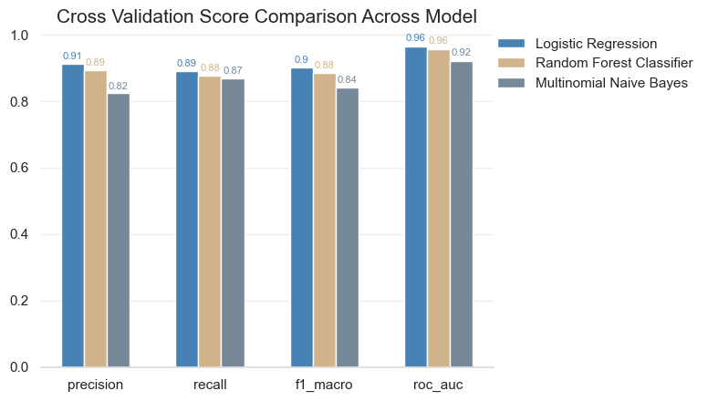

# News Content NLP Projects - Fake News Detection and Topic Modeling

This is a news content NLP analysis written by Wally, Huang Lin, Chun. The project structure includes two main sections, one is the **Fake News Detection by Supervised ML based on Tfidf**, and the other is the **Sentiment Analysis with nltk and Topic Modeling with Gensim**. All the anayses were conducted based on the Fake News Classification Data Set on Kaggle.

https://www.kaggle.com/datasets/saurabhshahane/fake-news-classification

## Fake News Detection by Supervised ML based on Tfidf

In the first section, we aim at predicting fake news based on the text structures and vectors. We first use the `TfidfVectorizer()` <ins>(Term Frequency - Inverse Document Frequency) </ins> method built in the `sklearn` machine learning tool kit to extract features from raw texts.

Exploiting the ***tfidf*** of each document as feature matrix, we trained three candidate traditional machine learning models and selected the best-performing one as the final model to optimize.

Three models selected as candidates are:

1. Logistic Regression ($\because$ Efficiency)
2. Random Forest Classifier ($\because$ Versatility)
3. Multinomial NB ($\because$ Strength of text classification)

The following is the evaluation scores obtained from the best performing cross validation fold. `Logistic Regression` outperformed the rest two models.

- Best Performing CV Fold Scores

- Precision-Recall Curve & ROC

- Confusion Matrix

Therefore, we selected `Logistic Regression` as the final model to optimize. We conduct hyper parameter tuning by `GridSearchCV()` method on the `C` parameter (degree of regularization) of `Logistic Regression` model.

According to the result, the model is optimized when `C` = 10. The following is the scores on test set when `C` = 10.

## Sentiment Analysis with nltk and Topic Modeling with Gensim

In the second section, we focused on the sentiment analysis of news based on the bag of word method (`nltk`) and topic modeling based on Latent Dilichlet Allocation (LDA, `gensim`). Four main analyses were conducted.

1. WordCloud Analysis conditioned on label (fake news or not)
2. Sentiment Analysis conditioned on label
3. Word Count, Sentiment Index, and Truthfulness
4. LDA Topic Modeling

   -  Word Count distribution analysis conditioned on topics
   -  WordCloud conditioned on topics
   -  Topics distribution conditioned on label
  

### WoldCloud Analysis conditioned on label

### Sentiment Analysis conditioned on Label

It seems that there is no significant difference between real & fake news in terms of sentiment score distributions. Therefore, it might be difficult to identify fake news based on only the sentiment score.

### Word Count, Sentiment Index, and Truthfulness

We interacted the word counts with each sentiment indexes and rendered the scatter plots conditioned on the label. Similarly, we did not observe any meaningful correlation between word counts and sentiment indexes and these two covariates seem not distinguishing fake news well.

### LDA Topic Modeling

#### Word Count distribution analysis conditioned on topics

#### WordCloud conditioned on topics

We generated the following topic-conditioned wordclouds first, identified each topic afterwards, and assigned the title to each topics.

#### WordCloud conditioned on topics

We generated the following topic-conditioned wordclouds first, identified each topic afterwards, and assigned the title to each topics.

#### Topics distribution conditioned on label

Based on the stacked bar plot above, we observed that among real news, topic "Republicans" is prevalent, which is surprising. In addition, real news also have higher proportion of other news, which might indicate that real news are more diversified.

On the other hand, among fake news, topic "Middle East and Russia" is prominently high, which might indicate that the U.S. is prone to international fake news attack. 

